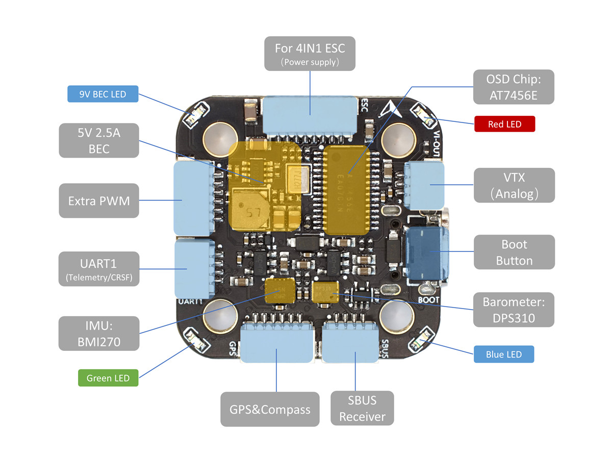
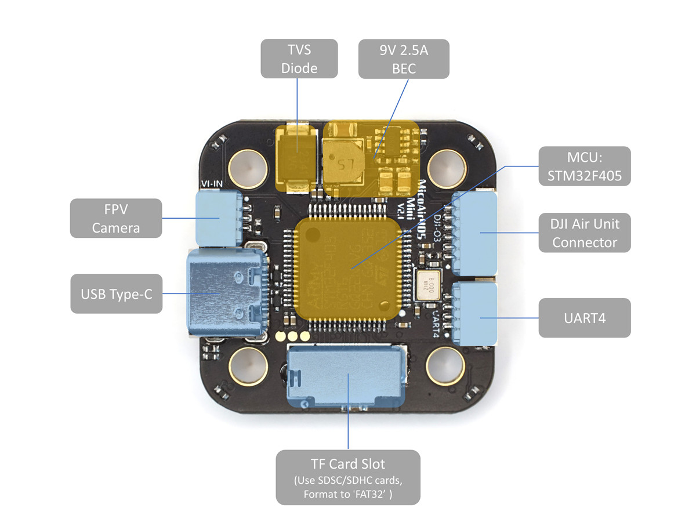
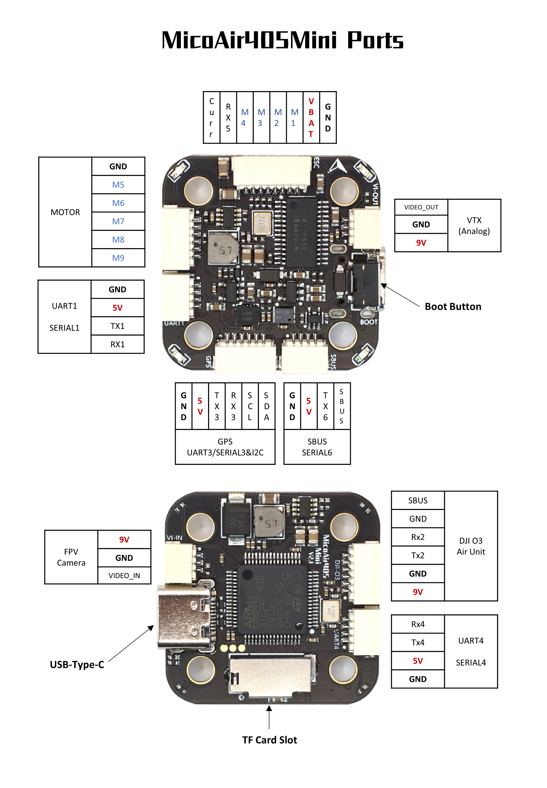

# MicoAir405Mini Flight Controller

The MicoAir405Mini is a small size flight controller designed and produced by [MicoAir Tech](https://micoair.com/index.php/flightcontroller_micoair405mini/).

## Features

 - STM32F405 microcontroller
 - BMI270 IMU
 - DPS310 barometer
 - AT7456E OSD
 - 9V 2.5A BEC; 5V 2.5A BEC
 - SDCard slot
 - 6 UARTs
 - 9 PWM outputs

## Firmware

MicoAir405Mini supports **Ardupilot**/**INAV**/**Betaflight**.

You can download the firmware from this repository.

## Physical

## UART Mapping for Ardupilot

 - SERIAL0 -> USB
 - SERIAL1 -> UART1 (DMA-enabled)
 - SERIAL2 -> UART2 (DJI - VTX, DMA-enabled) 
 - SERIAL3 -> UART3 (GPS)
 - SERIAL4 -> UART4 (DMA-enabled)
 - SERIAL5 -> UART5 (ESC Telemetry)
 - SERIAL6 -> UART6 (RX6 is inverted from SBUS pin, no DMA on TX6)

## RC Input

The default RC input is configured on the UART6_RX inverted from the SBUS pin. Other RC  protocols  should be applied at other UART port such as UART1 or UART4, and set the protocol to receive RC data: `SERIALn_PROTOCOL=23` and change SERIAL6 _Protocol to something other than '23'

## OSD Support

The MicoAir405Mini supports OSD using OSD_TYPE 1 (MAX7456 driver).

## VTX Support

The SH1.0-6P connector supports a standard DJI HD VTX connection. Pin 1 of the connector is 9v so be careful not to connect
this to a peripheral requiring 5v.

## PWM Output

The MicoAir405Mini supports up to 10 PWM outputs.

Channels 1-8 support DShot.

Channels 1-4 support bi-directional DShot.
PWM outputsare grouped and every  group must use the same output protocol:
- 1,2,5,6 are group 1
- 3,4 are group 2
- 7,8 are group 3
- 9 are in group 4

## Battery Monitoring

The board has a internal voltage sensor and connections on the ESC connector for an external current sensor input.
The voltage sensor can handle up to 6S LiPo batteries.

The default battery parameters are:

 - BATT_MONITOR 4
 - BATT_VOLT_PIN 10
 - BATT_CURR_PIN 11
 - BATT_VOLT_MULT 21.2
 - BATT_CURR_SCALE 40.2

## Compass

The MicoAir405Mini does not have a built-in compass, but you can attach an external compass using I2C on the SDA and SCL connector.

## Ports Connector

## Loading Firmware for Ardupilot

Initial bootloader load can be done with DFU by plugging in USB with the boot button pressed. Then you should load the "MicoAir405Mini_AP_Bootloader.bin" firmware, using your favorite DFU loading tool.

Once the initial bootloader is loaded you can update the firmware using any ArduPilot ground station software. Updates should be done with the "*.apj" firmware files.